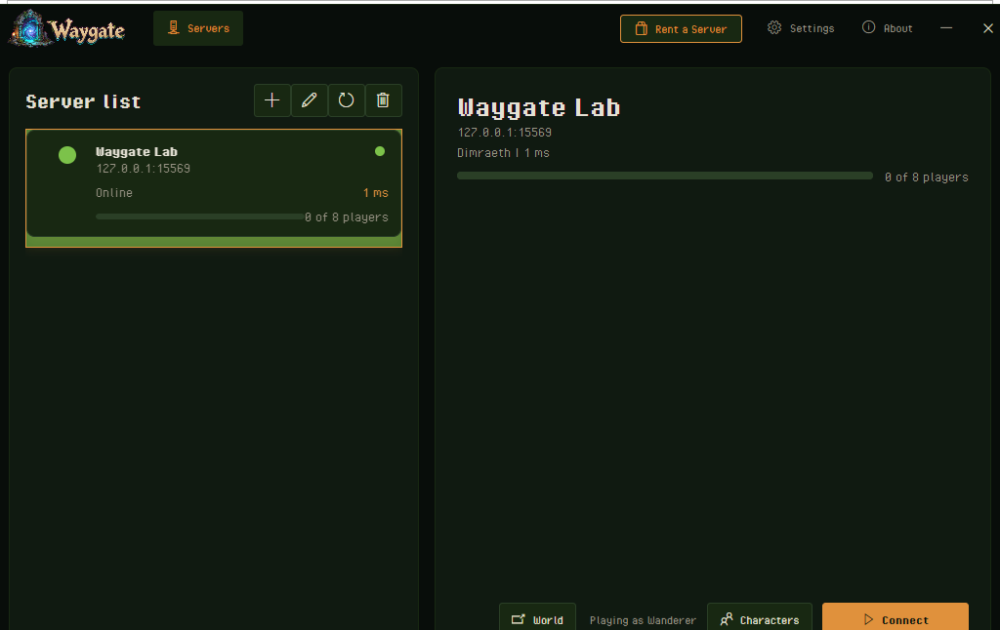
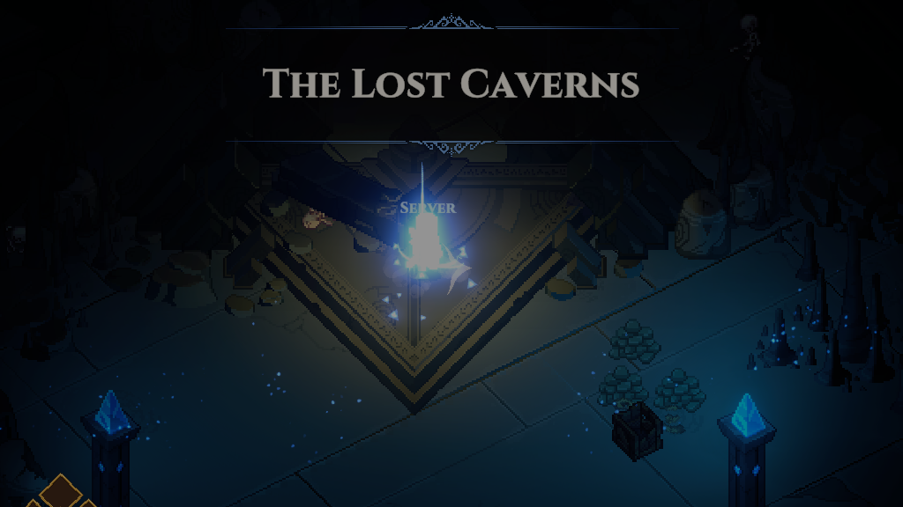
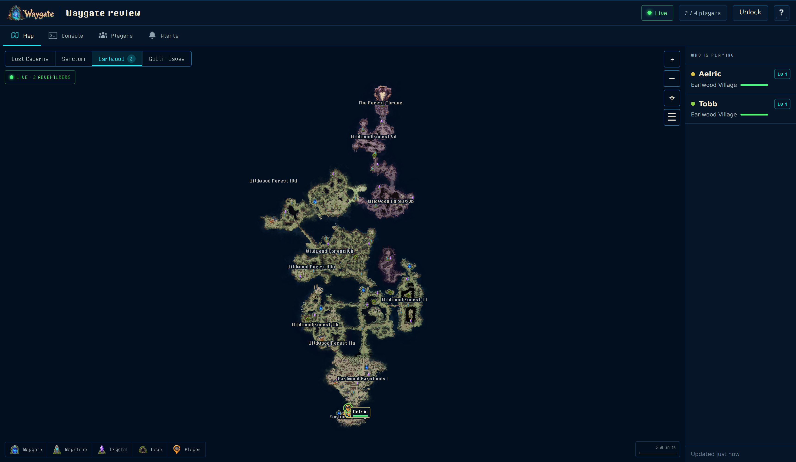
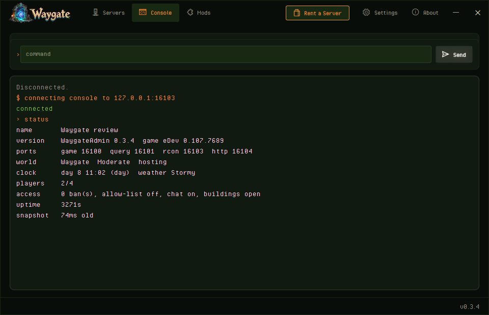
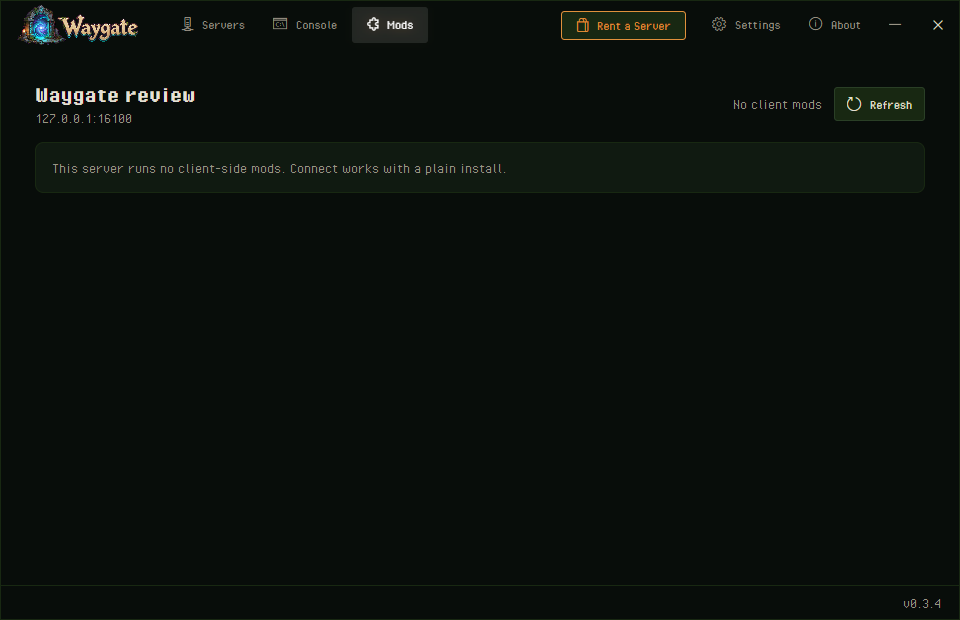
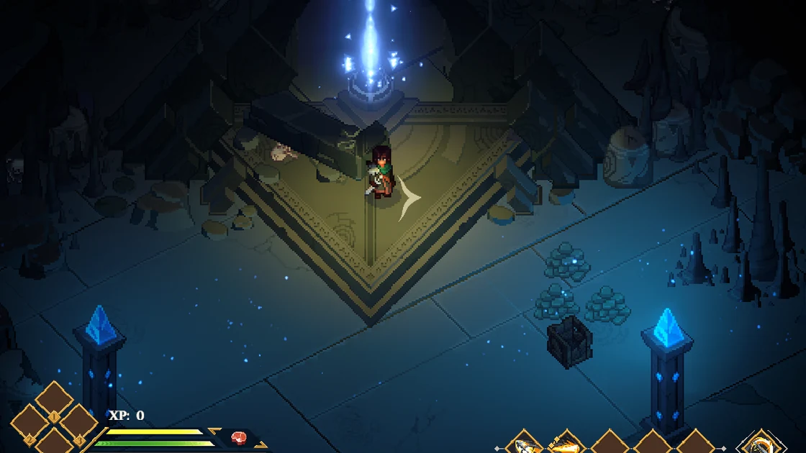

  

  
  
  
  
  

# Waygate

Dimraeth has no dedicated server. Its multiplayer is a Steam lobby hosted from one player's copy of the game. Waygate adds a Dimraeth dedicated server: [WaygateServer](https://github.com/HumanGenome/WaygateServer) runs the game headless on a Windows machine with a public IP and port, and the Waygate app connects players to it by address.

Every player must install Waygate to join a Waygate server. Stock Dimraeth cannot connect to a Waygate server directly.

  

## Features

### 🧭 Join by address
Add the server's `ip:port` in the app, pick a character, click Connect. The app puts the connection mod next to your game files, starts Dimraeth and joins the server. The app shows whether the server is up and how many players are on it.

  

### 👥 Eight players, eight seats
Dimraeth's own co-op limit is eight. The server has no character of its own, so every seat goes to a player. The first player in leads the party and the rest join it.

### 🧝 Your own characters
Heroes are made in the game as always and stay on your PC. The app lists them and you choose which one to bring to a server.

### 🔒 Join password
Set one on the server and the app asks for it before connecting.

### 💬 Chat switch
The host can turn player chat off for the whole server. Dimraeth's own chat setting is per player; this one is enforced on the server.

### 🗺️ The server's own web page
Every Waygate server serves a page about itself: the world map drawn from the game's own pixels, sharp all the way in to the game's closest zoom, with each player's position every five seconds, the Waygates and crystals they have found, and a fog of war over every region nobody has discovered yet; the console, who is playing and Discord alerts. Players get the map by address; the owner unlocks the rest with the admin password. Details in [WaygateServer](https://github.com/HumanGenome/WaygateServer#the-web-page).

  

### 🖥️ Console in the app
The Console tab in the app talks to the server's admin port: the live log, the command line and the same commands the server's page has, once the admin password is set.

  

### 🧩 Mods
Server mods run on the server and players install nothing. A mod that needs a piece on the player's side is published by the server, and the Mods tab installs it into a profile for that server when you connect, asks once, and removes what a server no longer needs. A plain Steam start of the game never sees any of it.

  

### 📡 Server query
The server answers Source A2S on the port above the gameplay port with its status and player count, so monitoring tools and hosting panels can read it.

### 🚦 Boot report
If the server cannot start, it writes what stopped it to `waygate\boot-report.txt` and refuses to run.

### 🔄 Plain game afterwards
Starting Dimraeth from Steam after a Waygate session runs the normal game. The mod only acts when the app started the game; while it is on, the game's version corner reads the Waygate version beside the game's. The app updates itself on start.

  

## Install

### Managed hosting
[SurvivalServers.com Dimraeth server hosting](https://www.survivalservers.com/services/game_servers/dimraeth/?utm_source=github&utm_medium=readme_install&utm_campaign=waygate) comes with Waygate installed and the ports open. The control panel has an Open in Waygate button that adds the server to the app.

### Players
1. Download `WaygateSetup-latest.exe` from the [latest release](https://github.com/HumanGenome/Waygate/releases/latest/download/WaygateSetup-latest.exe).
2. Run it. One install per PC.
3. Open Waygate, add the server address, pick a character, click Connect.

### Self-hosted servers
Requirements, ports, setup, the web page, the status file and the commands are in [WaygateServer](https://github.com/HumanGenome/WaygateServer). You need a Windows machine and a copy of Dimraeth's game files on it from your own Steam copy.

## Releases

This repo publishes the player side: `WaygateSetup-<version>.exe`, a `WaygateSetup-latest.exe` alias, and the release notes. The server package is on the [WaygateServer release page](https://github.com/HumanGenome/WaygateServer/releases/latest), with the changelog for both sides in [WaygateServer's CHANGELOG](https://github.com/HumanGenome/WaygateServer/blob/main/CHANGELOG.md).

## Source

- **Waygate** (this repo): the app players install, the downloads and the documentation.
- **[WaygateServer](https://github.com/HumanGenome/WaygateServer)**: the server package hosts run next to Dimraeth's game files.

## FAQ

### Does everyone need the app?
Yes. The game cannot reach a Waygate server without it.

### Does it change my game?
It adds `winhttp.dll` and a `BepInEx` folder next to `Dimraeth.exe`. Steam updates the game as normal. Delete those two to remove it.

### Where is my hero saved?
On your PC, where Dimraeth keeps it. The server holds the world.

### Can a world move between servers?
Yes. The world save is a folder on the server; copy it to the other server.

### Is this official?
No. Waygate is an independent project. Mudtek does not ship dedicated servers for Dimraeth.

### Something broke
[Open an issue](https://github.com/HumanGenome/Waygate/issues). If you rent a server, your host handles billing and control panel questions.

## Contributing

See [CONTRIBUTING.md](CONTRIBUTING.md). Security issues go through [private reporting](.github/SECURITY.md), never a public issue.

## Community note

Waygate is an independent community project. It is not affiliated with, endorsed by, or supported by Mudtek.

## License

MIT, see [LICENSE](LICENSE).
